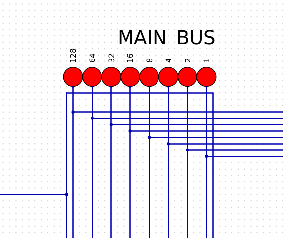
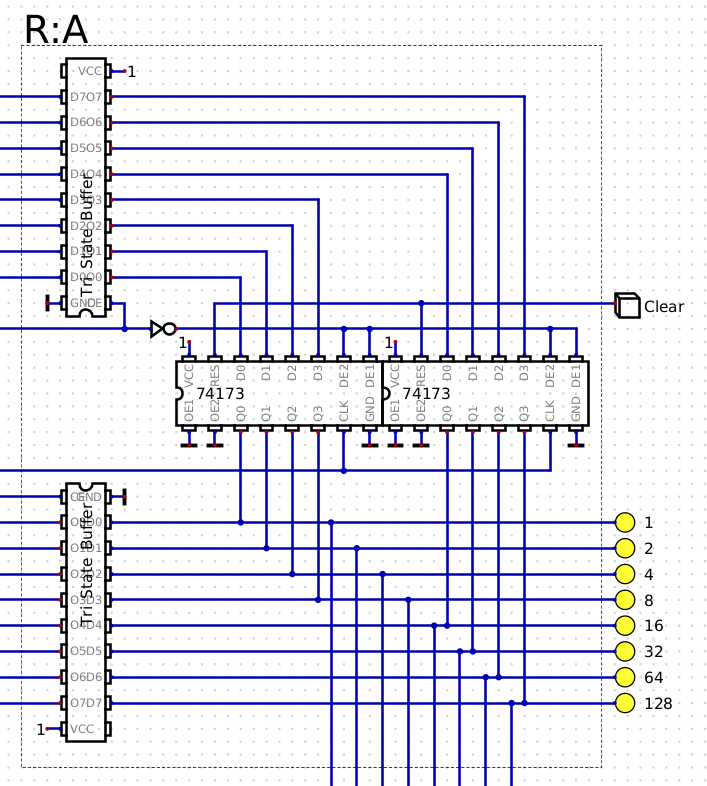
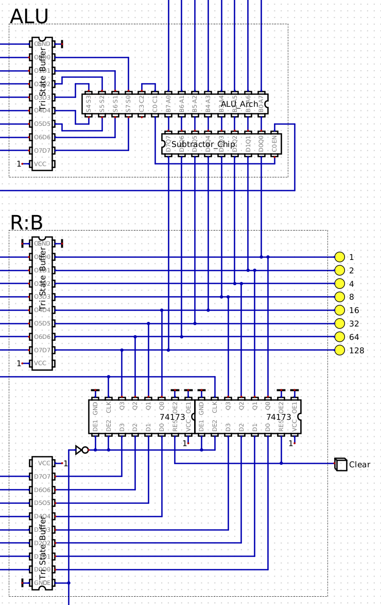
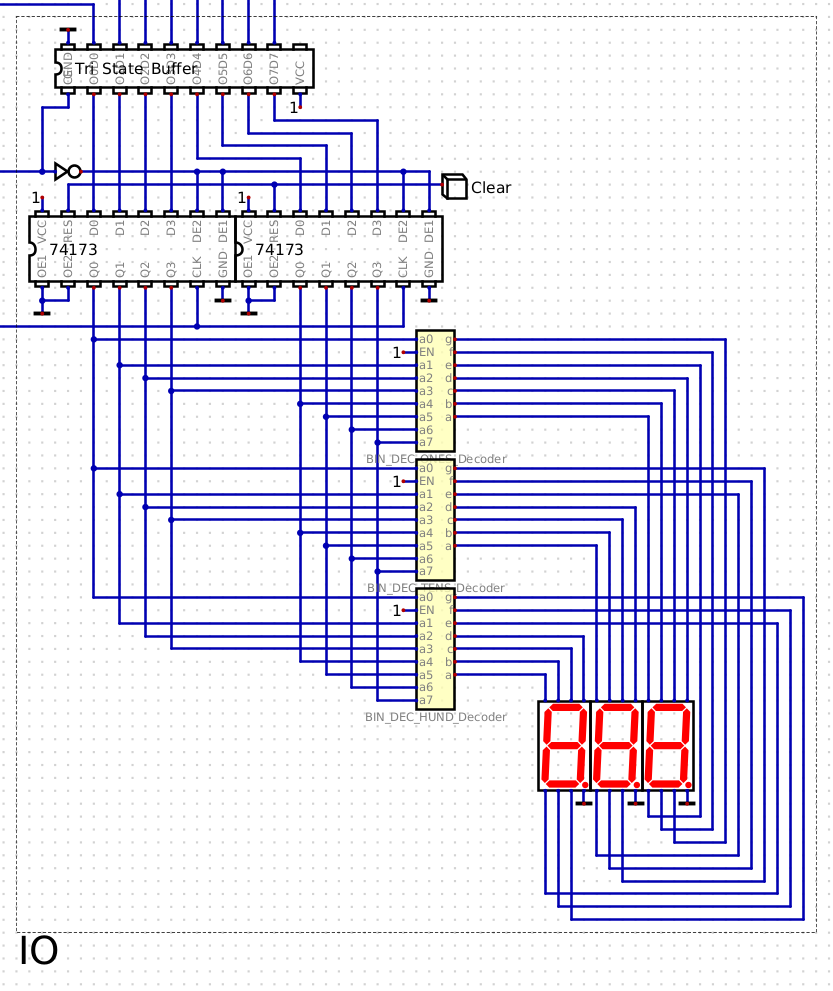

# Control Logic

## Overview
The Control Logic orchestrates all CPU operations by generating control signals that coordinate component interactions based on the current instruction and execution step.

## Implementation
- **Step Counter**: 74138 3-to-8 decoder and 74161 4-bit counter tracking the current execution phase
- **Control ROM**: Microcode storage containing control signal patterns for each instruction
- **Instruction Register Interface**: 74173 register storing the current opcode
- **Logic Gates**: Series of logic gates for generating specific control signals
- **Manual Control**: Switch for direct manipulation of control signals

## Operation
- **Instruction Decoding**: Translates opcodes into specific control signal patterns
- **Execution Phases**: Steps through fetch, decode, and execute cycles for each instruction
- **Signal Generation**: Activates the appropriate control lines (MI, MO, II, IO, AI, AO, etc.)
- **Timing Control**: Synchronizes operations across all CPU components
- **Halt Capability**: HLT signal for stopping program execution

# Clock System

## Overview
A 5Hz clock generator providing the fundamental timing signals that drive the synchronous operation of the CPU.

## Implementation
- **Oscillator**: Adjustable timing circuit generating the base clock signal
- **Manual Step**: Push button (P) for single-step operation
- **Logic Gates**: AND/OR gate combination for mode selection
- **Visual Indicator**: Blue LED showing clock pulses

## Operation
- **Continuous Mode**: Regular 5Hz pulses for normal operation
- **Single-Step Mode**: Manual advancement of the clock for debugging
- **Clock Distribution**: Signal routed to all synchronous components
- **Synchronization**: Ensures orderly execution of multi-step operations

## Integration
The control logic and clock form the "brain" of the CPU, with the clock establishing the execution rhythm while the control logic determines exactly which operations occur during each clock cycle. Together they implement the fetch-decode-execute cycle that defines program execution, with control signals orchestrating data movement between components based on the instruction being processed.

# Main Bus

## Overview
The main bus serves as the central data pathway of the 8-bit CPU, connecting all components and enabling data transfer throughout the system.

## Implementation
- **Structure**: 8 parallel lines corresponding to each bit (1, 2, 4, 8, 16, 32, 64, 128)
- **Visual Indicators**: 8 red LEDs displaying the current data values present on the bus
- **Connection Points**: Interface points for all CPU components (registers, ALU, memory, etc.)

## Operation
- **Data Transfer**: Facilitates movement of 8-bit values between CPU components
- **Shared Resource**: Only one component can write to the bus at any given time
- **Visibility**: LED indicators provide real-time visual feedback of data flow
- **Control**: Component access to the bus is managed by tri-state buffers and control logic

## Integration
Forms the backbone of the CPU architecture, connecting all functional units including Register A, Register B, ALU, and other components to enable program execution through coordinated data movement.

# Register A (R:A)

## Overview
An 8-bit general-purpose register implemented using two 74173 4-bit D-type register ICs. Functions as temporary storage during CPU operations.

## Implementation
- **Hardware**: 2× 74173 ICs (4-bit D-type registers with tri-state outputs)
- **Visual Feedback**: 8 LEDs displaying bit values (1, 2, 4, 8, 16, 32, 64, 128)
- **Control Signals**: Clock, Clear, Output Enable, Input Enable

## Operation
- **Load**: Captures 8-bit value from bus when Input Enable active
- **Store**: Maintains value until next load operation or clear signal
- **Output**: Places stored value on bus when Output Enable active
- **Reset**: Clears register to 0 when Clear signal received

## Integration
Serves as temporary storage for ALU operations, data transfer, and program state within the CPU architecture.

# Arithmetic Logic Unit (ALU)

## Overview
The ALU is the computational core of the 8-bit CPU, handling arithmetic and logical operations between values stored in registers. Implemented using specialized arithmetic ICs with bus interfacing.

## Implementation
- **Hardware**: Custom "ALU_Arch" chip and "Subtractor_Chip" for arithmetic operations
- **Input Source**: Data from tri-state buffer (Register A as primary input)
- **Secondary Input**: Register B serves as the second operand
- **Bus Interface**: Tri-state buffers controlling data flow to/from the system bus

## Operations
- **Addition**: Adds values from Register A and Register B
- **Subtraction**: Subtracts Register B from Register A using the Subtractor Chip
- **Data Flow**: Results are placed on the data bus for storage in designated registers
- **Control Signals**: Operation selection managed through control lines

## Integration
The ALU works in conjunction with the register system, particularly Register B (shown in the lower portion of the schematic), using 74173 ICs similar to Register A for temporary storage during computations.

# I/O Section

## Overview
The I/O section provides visual output capabilities for the CPU through seven-segment displays, converting binary values to decimal representation using binary-to-decimal decoders.

## Implementation
- **Storage**: Two 74173 4-bit D-type registers for data buffering
- **Interface**: Tri-State Buffer connecting to the main bus
- **Conversion**: Three binary-to-decimal decoders (BIN_DEC) for value translation
- **Display**: Three 7-segment displays for presenting decimal values
- **Sign Handling**: Support for displaying negative values

## Operation
- **Data Capture**: Registers store the 8-bit value from the main bus
- **Decoding**: Binary values are decoded into segment patterns using truth tables stored in the decoders
- **Display Control**: Each decoder controls a single 7-segment display unit
- **Number Range**: Capable of displaying both positive and negative decimal values

## Integration
Allows the CPU to communicate output values to the user, providing real-time visual feedback of computation results and program execution state through the decimal display system.

# Program Counter (PC)

## Overview
The Program Counter keeps track of the current instruction address during program execution, automatically incrementing to step through program memory sequentially.

## Implementation
- **Core Component**: 74161 4-bit synchronous binary counter
- **Bus Interface**: Tri-state buffers for input/output to the main bus
- **Visual Indicators**: 4 green LEDs showing the current address value (1, 2, 4, 8)
- **Control Signals**: Clear input for reset, Clock input for timing

## Operation
- **Count Sequence**: Automatically increments address on clock pulses
- **Reset**: Returns to address 0 when Clear signal is activated
- **Bus Interaction**: Can output current address to bus or load new address from bus
- **Address Range**: 4-bit implementation allows addressing of 16 distinct memory locations

## Integration
Acts as the instruction pointer for the CPU, determining which instruction is fetched from memory during each cycle of program execution, enabling sequential program flow and jump operations.

# Instruction Register (R:I)

## Overview
The Instruction Register stores the current instruction being executed by the CPU, separating the opcode from the address bits to control program flow.

## Implementation
- **Storage**: Two 74173 4-bit D-type registers for complete instruction storage
- **Bus Interface**: Tri-state buffers for data flow to/from the main bus
- **Visual Indicators**: 8 LEDs (4 blue for address bits, 4 yellow for instruction bits)
- **Control Lines**: Clock and Clear signals for synchronization

## Operation
- **Instruction Format**: 8-bit format split into 4-bit opcode and 4-bit address/data field
- **Fetch Cycle**: Loads complete instruction from memory during instruction fetch
- **Decode**: Separates opcode (instruction bits) from operand (address bits)
- **Control**: Instruction bits feed into control logic to determine CPU operations
- **Addressing**: Address bits can be output to the bus for memory access or jumping

## Integration
Forms a critical part of the CPU's instruction cycle, holding the current instruction while it's being decoded and executed, enabling the control unit to coordinate operations based on the opcode.

# Memory and Memory Address Register (MAR)

## Memory Address Register (MAR)

### Overview
The MAR holds the current memory address being accessed, providing the address lines necessary to target specific locations in program memory.

### Implementation
- **Storage**: 74173 4-bit D-type register
- **Bus Interface**: Tri-state buffers for address loading from the main bus
- **Clear**: Reset signal for initialization
- **Control Lines**: Clock input for synchronous operation

### Operation
- **Address Holding**: Maintains the 4-bit address during memory read/write operations
- **Sequential Access**: Works with the Program Counter for instruction fetching
- **Random Access**: Can be loaded with any address for data access or jumps

## 64-Bit Memory

### Overview
Stores the program instructions and data in a 64-bit (16×4-bit) configuration, allowing for 16 addressable 4-bit values.

### Implementation
- **Storage**: "ArthRAM" memory chip with 16 addressable locations
- **Addressing**: 4 address lines (A0-A3) selecting one of 16 memory locations
- **Data Lines**: 8 data lines (D0-D7) for 8-bit instruction/data storage
- **Visual Indicators**: 8 green LEDs showing contents of the currently addressed memory location
- **Control Features**: Manual mode and Memory Set switches for programming

### Operation
- **Program Storage**: Holds assembly instructions for CPU execution
- **Data Retrieval**: Outputs 8-bit value from the addressed memory location
- **Programming**: Can be manually programmed via the Memory Set mode and address selectors
- **Bus Interface**: Tri-state buffer controlling data output to the main bus

## Integration
Together, the MAR and Memory form the program storage system of the CPU, with the MAR determining which instruction or data value is accessed from memory during each phase of program execution. The manual programming capability allows for direct input of assembly instructions into memory for subsequent execution.
